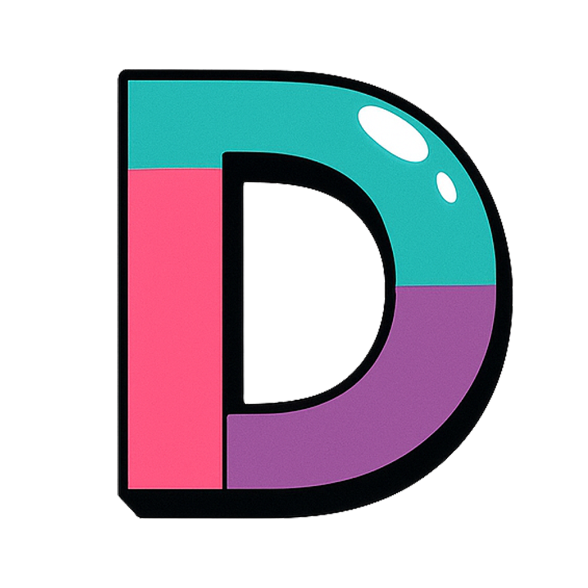

<p align="center">
  <a href="https://www.dmxapi.cn/"></a>
</p>

<h1 align="center">DMXAPI-DSH配置工具</h1>

<p align="center"><strong>DMXAPI 官方出品</strong> · 让 DeepSeek Harness 的第三方模型接入更简单</p>

<p align="center">
  <a href="https://github.com/YV919/dmxapi-dsh/releases/latest">下载插件</a> ·
  <a href="#快速开始">快速开始</a> ·
  <a href="QUICKSTART.md">详细安装指南</a> ·
  <a href="https://www.dmxapi.cn/">DMXAPI 官网</a> ·
  <a href="https://doc.dmxapi.cn/">官方文档</a>
</p>

<p align="center">
  <a href="https://github.com/YV919/dmxapi-dsh/releases"></a>
  <a href="LICENSE"></a>
  
</p>

---

在 DeepSeek Harness Web 的设置页，直接添加 DMXAPI 模型。无需手写服务商 YAML，也无需先设置 API Key 环境变量：选择接口预设、填写自己的密钥、确认模型参数，即可在原生聊天界面选用新模型。插件只**新增**服务商，已有配置与密钥保持原样。

> **一个 Key，用全球大模型。** [DMXAPI](https://www.dmxapi.cn/) 提供统一的模型 API 服务。本工具由 DMXAPI 官方制作，预设 Chat、Responses、Anthropic 三类接入方式；可用模型、账号权限与计费以你的 DMXAPI 账号及[官方模型目录](https://doc.dmxapi.cn/omp.html)为准。

## 为什么选择这个插件

| 功能 | 你可以做什么 |
| --- | --- |
| 三种接口，各用其所长 | 分别新建 **DMXAPI · Chat**、**DMXAPI · Responses**、**DMXAPI · Anthropic**，将模型放进对应协议。 |
| 12 个模型预设 | 按接口预填模型 ID、图片输入声明、上下文、输出上限和适用的思考选项；所有数值都可核对和调整。 |
| 思考等级贴近原生 | Qwen 显示 `off / medium / xhigh`，MiMo 显示 **关闭 / 开启**；其他模型只显示各自预设的选项，避免无谓的等级映射。 |
| 密钥直接填写 | API Key 输入默认隐藏，可切换显示；保存时交给 Harness 凭据服务，无需写入 YAML 或配置环境变量。 |
| 原配置不受影响 | 只提供新增入口；同名预设自动使用新标识，不覆盖旧服务商及其密钥。 |
| 自定义空间 | 可新建其他服务商，修改模型能力和参数，或导入、导出单服务商 YAML。 |

## 快速开始

**适用版本：DeepSeek Harness Web `0.1.5-rc.2`；需要 Node.js 22 或更新版本。** 其他 Harness 版本尚未完成适配验证。

1. 下载 [Windows 安装包 `dsh-dmxapi-0.1.8-windows.zip`](https://github.com/YV919/dmxapi-dsh/releases/download/v0.1.8/dsh-dmxapi-0.1.8-windows.zip)，完整解压。在解压后的文件夹打开 PowerShell，运行：

   ```powershell
   .\install.ps1
   ```

2. 关闭已有 Harness 服务，重新启动并刷新网页：

   ```powershell
   npx --yes @deepseek-ai/dsh@0.1.5-rc.2 web
   ```

3. 打开 **设置 → 插件 → 插件配置 → DMXAPI-DSH配置工具**，选择一个预设，填写自己的 DMXAPI API Key，点击 **新增配置**。回到聊天界面，从原生模型选择器选择新模型。

安装脚本默认安装到当前用户 `.dsh` 的 `web` profile；如设置了 `DSH_HOME`，会使用该目录。脚本保留预构建包，方便后续重装。其他平台可下载同一 Release 的 `.tgz`，按 [Harness 官方插件安装说明](https://deepseek-harness.github.io/deepseek-harness/develop/basic/publish)安装。更多安装与使用步骤见 [QUICKSTART.md](QUICKSTART.md)。

## 配置体验与密钥保护

三种 DMXAPI 预设已填好各自的模型清单；也可选择 **新建自定义服务商**。展开模型卡可以检查图片输入、思考选项和容量，再点击 **新增配置**。模型仍由 Harness 原生聊天菜单选择，图片仍通过原生附件按钮上传。

插件**只新增配置**，不显示同步状态，也不编辑或覆盖已有服务商。已有配置继续保留，可在 Harness 的 **设置 → 模型** 中管理。同名预设自动使用 `dmxapi-chat-2`、`dmxapi-chat-3` 等可用标识；手动填写已有标识时会拒绝新增。安装或升级插件不会自动迁移模型配置。

填写 API Key 会为新服务商生成独立的随机凭据引用，不替换任何旧引用中的密钥。输入框留空时，仅保留草稿中显式导入的凭据引用，不读写凭据。保存成功后输入框清空并恢复隐藏；切换预设或取消修改也会清空当前输入。如果配置新增成功但密钥写入失败，“重试密钥”只重试本次创建的密钥，并检查创建版本和引用，不重复写模型配置；也可选择“继续新建”，稍后在原生模型页补充。

新建草稿中的模型可以独立设置文本/图片、上下文、输出上限和思考选项。技术传输方式与 YAML 放在折叠的高级配置中。不要把密钥填进 YAML，也不要在配置中写 `apiKey`。密钥由 Harness 凭据服务保存，`apiKeyEnv` 仅作为引用。导入只读环境变量引用也不限制填写新密钥：填写时为新服务商独立保存，原引用保持不变。

## 接口协议与地址

三种新建预设各有独立服务商 ID、协议和地址。在同一服务商内添加模型时，它们共用该服务商的协议；需要另一种格式时，新建对应的服务商。可以在新草稿中修改协议。切换协议后，保存与 YAML 导出会自动清理已知不适用于目标协议的 `compat` 字段，涵盖服务商、模型和 `modelOverrides`；保存前会显示调整提示。未知字段仍交给 Harness 校验。

仅对精确匹配 DMXAPI 预设根地址或 `/v1` 地址的配置，插件按协议修正地址：

| 协议 | DMXAPI 配置地址 | SDK 请求路径 |
| --- | --- | --- |
| OpenAI Chat Completions | `https://www.dmxapi.cn/v1` | `/v1/chat/completions` |
| OpenAI Responses | `https://www.dmxapi.cn/v1` | `/v1/responses` |
| Anthropic Messages | `https://www.dmxapi.cn` | `/v1/messages` |

Anthropic SDK 自行追加 `/v1/messages`，使用根地址可避免出现 `/v1/v1/messages`。其他自定义地址不会自动修改。DMXAPI 的密钥需与所在站点的域名匹配；其他站点请按其实际域名填写。[DMXAPI 地址说明](https://doc.dmxapi.cn/baseurl.html)

配置前应确认模型支持的接口格式。DMXAPI 的[模型列表查询说明](https://doc.dmxapi.cn/omp.html)介绍了 `supported_endpoint_types`；名称带 `-cc` 的模型一般走 Anthropic 格式。[DMXAPI 格式切换说明](https://doc.dmxapi.cn/cherry-studio-model-format.html) 表单保存成功表示通过 Harness 配置校验，不能代替真实模型接口验收。

## 已预设模型

下表按表单中的顺序列出模型。容量是按上游公开资料整理的预设值，输入列表示插件预设的图片能力；**DMXAPI 对具体 ID 的路由、账号权限及参数支持仍需用自己的 Key 验证**，尤其是快照 ID 与 `-cc` 别名。模型卡可逐项修改。

| 格式 | 模型 ID（从上到下） | 图片 | 上下文 / 最大输出 | 默认可选思考等级 |
| --- | --- | --- | --- | --- |
| Chat | `deepseek-v4.1-flash` | 是 | 1M / 384K | `off / low / high / max` |
| Chat | `glm-5.3` | 否 | 1M / 128K | `low / high / max` |
| Chat | `glm-5.3-flash` | 是 | 1M / 128K | `low / high / max` |
| Chat | `qwen3.8-max` | 是 | 1M / 131072 | `off / medium / xhigh` |
| Chat | `qwen3.8-max-0902` | 是 | 1M / 131072 | `off / medium / xhigh` |
| Chat | `mimo-v2.6-pro` | 是 | 1M / 128K | 关闭 / 开启 |
| Responses | `gpt-6-astra` | 是 | 1050K / 128K | `low / high / max` |
| Responses | `gpt-6-sol` | 是 | 1050K / 128K | `off / low / high / max` |
| Responses | `gpt-6-luna` | 是 | 1050K / 128K | `off / low / high / max` |
| Anthropic | `claude-fable-5-1-cc` | 是 | 1M / 128K | `low / high / max` |
| Anthropic | `claude-opus-5-5-cc` | 是 | 1M / 128K | `low / high / max` |
| Anthropic | `claude-sonnet-5-cc` | 是 | 1M / 128K | `off / low / high / max` |

规格与原生参数分别依据 [DeepSeek](https://api-docs.deepseek.com/quick_start/pricing/)、[GLM-5.3](https://docs.z.ai/guides/llm/glm-5.3)、[GLM-5.3-Flash](https://docs.z.ai/guides/vlm/glm-5.3-flash)、[Qwen3.8](https://help.aliyun.com/en/model-studio/qwen3-8-max)、[MiMo](https://mimo.mi.com/models/zh-CN/mimo-v2.6-pro)、[OpenAI GPT-6 Astra](https://developers.openai.com/api/docs/models/gpt-6-astra)、[Sol](https://developers.openai.com/api/docs/models/gpt-6-sol)、[Luna](https://developers.openai.com/api/docs/models/gpt-6-luna) 与 [Claude Fable](https://platform.claude.com/docs/en/models/fable-5-1/overview)、[Opus](https://platform.claude.com/docs/en/models/opus-5-5/overview)、[Sonnet](https://platform.claude.com/docs/en/models/sonnet-5/overview) 的官方资料；[Qwen 的 Chat 参数](https://help.aliyun.com/zh/model-studio/qwen-api-via-openai-chat-completions)、[MiMo 的 Chat 参数](https://mimo.mi.com/docs/en-US/api/chat/openai-api) 和 [Claude effort 参数](https://platform.claude.com/docs/en/build-with-claude/effort) 另见相应接口文档。三款 Claude 的 `-cc` 是用户要求保留的 **DMXAPI 路由 ID**；不能把它去掉后发送，也不应将其当作 Anthropic 官方模型 ID。DMXAPI 公开文档尚未逐一证实全部 12 个 ID 已对所有账号开放。

## 思考等级与多模态

Chat 预设使用 **跟随模型默认**：Qwen 默认 `medium`，其余已知预设默认 `high`；MiMo 将这一默认显示为 **开启**。Responses 与 Anthropic 服务商预设仍使用 `high`。这些是插件推荐默认值，不表示厂商 API 的默认值。模型卡只显示当前模型已有的选项，并提供添加与移除；GLM 不显示 `off`，MiMo 在配置表单和聊天菜单中显示 **关闭 / 开启**。只有模型和接口真的支持某个值时才应添加。

两个 Qwen 新预设直接使用原生 `off / medium / xhigh`，不再使用不同名称替代强度。升级不会改写旧配置的映射。若已新建或手工采用原生等级配置，而会话仍记着 `high` 或 `max`，请展开当前 Qwen 的 **思考等级** 菜单，重新选择 `medium` 或 `xhigh`；只重新选择同一个模型不会清除旧等级。

| 模型思考传输方式 | 预设模型 | 实际请求字段 |
| --- | --- | --- |
| DeepSeek · thinking + reasoning_effort | `deepseek-v4.1-flash` | `thinking.type` + `reasoning_effort`；`off` 显式发送 `disabled` |
| Z.AI · thinking + reasoning_effort | 两款 GLM | `thinking.type: enabled` + `reasoning_effort`；不提供 `off` |
| Qwen · enable_thinking + reasoning_effort | 两款 Qwen3.8 | 开启时 `enable_thinking: true` + 同名 `reasoning_effort: medium / xhigh`；`off` 发送 `enable_thinking: false`，不同时发送 `thinking_budget` |
| MiMo · 思考开关 | `mimo-v2.6-pro` | **开启**发送 `thinking.type: enabled`，**关闭**发送 `thinking.type: disabled`；不发送 `reasoning_effort` |
| Responses · reasoning.effort | 三款 GPT-6 | `reasoning.effort`；Astra 不提供 `off`，Sol/Luna 的 `off` 发送 `none` |
| Claude · adaptive + effort | 三款 Claude | `thinking.type: adaptive` + `output_config.effort`；Fable/Opus 不提供 `off`，Sonnet 的 `off` 发送 `disabled` |

日常配置只需选择模型支持的思考选项。传输方式与 YAML 收在折叠的高级配置内；Anthropic 按模型显示适用方式，Claude 预设使用 adaptive + effort，不再列出与该模型无关的模式。导入的自定义草稿保留其高级字段。为其他模型选择新方式前，先核对厂商文档和 DMXAPI 接口说明；表单只控制本插件提交给 Harness 的配置，不会替上游开启模型能力。

**DeepSeek Anthropic** 模式只用于本插件的 DMXAPI Anthropic 预设中、ID 以 `deepseek-` 或 `deepseek.` 开头的模型；它需要本插件针对已验证 Harness 版本的请求体适配，依据 [DeepSeek 的 Anthropic 兼容说明](https://api-docs.deepseek.com/guides/anthropic_api/) 匹配该线路的字段。其他 Anthropic 模型不能套用此模式。Claude adaptive 模式只适用于支持自适应思考的 Claude 模型；例如 [DMXAPI 的 Opus 4.7 说明](https://doc.dmxapi.cn/claude_opus_4_7.html)指出旧的 `thinking.enabled/budget_tokens` 会报 400。

各协议的请求字段由插件按所选模式生成，模型等级尽量保持原生名称；MiMo 只区分开关，Claude Fable/Opus 与 GLM-5.3 不允许关思考。自定义模型的技术参数仍可在高级配置中编辑。

服务商默认等级会应用于其所有模型，界面只提供这些模型共同支持的默认等级；已有不兼容值会提示修正。模型选项不相同时，选择 **跟随模型默认**，再在聊天中选择档位。高级 YAML 仍使用 Harness 支持的等级 ID；只有 `off` 的值可为 `null`，`reasoningEfforts: false` 表示不提供思考等级。MiMo 的内部兼容 ID 不改变其界面上的 **关闭 / 开启** 含义。

图片输入开关声明模型支持 `input: [text, image]`，由 Harness 原生附件通道处理。模型卡上的最大输出 `maxTokens` 同时是每次请求的默认输出上限；若网关限制较低，可手动调小。配置校验通过不能代替图片、工具调用和每个思考等级的线上验收。

上下文快捷值为 **256K（262144）/ 512K（524288）/ 1M（1000000）**；最大输出快捷值为 **64K（65536）/ 128K（131072）/ 256K（262144）**。仍可手工填写其他数值；快捷按钮不会改变每个模型的原厂上限，也不会自动替换已有容量。例如原预设的 128000 与按钮的 131072 并非同一数值。

## YAML 与更多自定义选项

旧版 DeepSeek Chat 配置的兼容示例见 [examples/dmxapi.yaml](examples/dmxapi.yaml)；新用户通常直接使用三种表单预设即可。导入支持一份单服务商配置：直接 `dmxapi:`、`providers: {dmxapi: ...}`，或完整 `llm-pi-ai.providers.dmxapi` 结构。多服务商文件会明确拒绝，避免意外漏掉条目。

可以通过 YAML 配置模型级 `compat`、timeout、retryPolicy 等 Harness 已支持字段。表单编辑会保留未展示的配置。插件做基础校验，保存时原生 adapter 会再次验证协议支持、模型目录和兼容字段。

导出会移除所有 `headers`，避免导出请求头中的密钥。凭据引用保留，密钥本身不导出。使用复杂请求头时请保留原始安全配置副本。

导入 YAML 一律作为新建草稿，同名时自动分配新标识。保存前会再次检查最新有效配置（包含 `cordis.yml` 继承来源），拒绝已存在的标识；提交只增加该新服务商路径。若其他页面或手工编辑先修改了设置，会拒绝旧版本提交并保留草稿，可先导出再重新载入。旧版预设仍兼容，但不再提供独立的新建入口。

## 从源码构建

```powershell
npm ci
npm run typecheck
npm test
npm run build
npm run pack:plugin
```

构建完成后可从 `artifacts/` 取得 `.tgz`。普通用户请优先使用 [Release 安装包](https://github.com/YV919/dmxapi-dsh/releases/latest)。

## 卸载

```powershell
npx @deepseek-ai/dsh@0.1.5-rc.2 plugin --profile web remove dsh-dmxapi
```

重启 Harness。已保存的模型配置与凭据仍由 Harness 管理，可在原生模型页手工删除。卸载也会移除插件提供的默认思考等级、MiMo 显示标签和 DeepSeek Anthropic 专用适配；继续使用模型前，请在聊天中显式选择该模型支持的原生等级，尤其不要让 GLM 等始终思考模型回退为关闭状态。MiMo 将恢复显示 Harness 内部的 `off / high`；使用 DeepSeek Anthropic 专用适配的配置需先切换到其他受支持的协议。

## 验证范围

自动化测试使用本地模拟 HTTP/SSE 服务以及真实发布版 Harness runtime，验证配置到实际请求参数的链路，不会向 DMXAPI 发送付费请求。

`0.1.8` 的回归目标包括三协议独立预设、Qwen 原生 `medium / xhigh` 请求、MiMo 开关且无 effort 参数、模型默认等级与菜单显示、图片与密钥流程；具体通过情况以该版本测试记录为准。本地模拟测试不代表 DMXAPI 的全部模型或其他供应商模型均已通过真实接口验收。

API Key 输入界面的验收使用隔离 profile 和虚构凭据，检查默认隐藏、显示切换、保存与导出隔离；这一流程不需要真实 Key，也不调用付费模型。验收结果以对应版本的测试记录为准。

2026-09-18 在开发者本机另行完成真实 DMXAPI 验收：`deepseek-v4.1-flash` 成功识别测试图片；`off / low / high / max` 四档均返回成功，关闭档无思考内容，其他三档返回思考内容。官方 Web 已确认配置卡、图片附件入口和四档选择菜单可用。接口能力仍以接收者自己的账号及服务商后续更新为准；安装包不包含 API Key。

依赖接口依据：[官方模型配置指南](https://deepseek-harness.github.io/deepseek-harness/en/guide/providers)、[官方插件设置卡说明](https://deepseek-harness.github.io/deepseek-harness/en/reference/cookbook/adding-a-settings-card)，以实际 `0.1.5-rc.2` 发布包为准。

## 项目与支持

插件以 [MIT 许可证](LICENSE)开源。配置问题或模型适配建议可在 [GitHub Issues](https://github.com/YV919/dmxapi-dsh/issues)反馈；开通账号、查询可用模型与价格，请访问 [DMXAPI 官网](https://www.dmxapi.cn/)及[官方文档](https://doc.dmxapi.cn/)。
